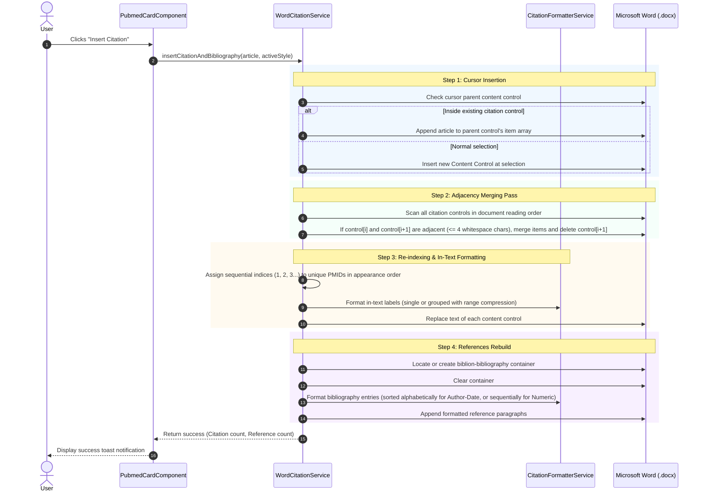

# Specification: Citation Insertion and Document Synchronization

**Project:** Biblion (PubMed / MEDLINE Office Add-in & Web Portal)  
**Document:** In-Text Citation Insertion, Adjacency Grouping, and References Synchronization Specification  
**Location:** `specs/citation_insert_spec.md`  

---

## 1. Overview and Purpose

The Biblion citation insertion engine provides seamless, automated citation insertion and reference management inside Microsoft Word documents using the Office JavaScript API (`Office.js`).

This specification documents the **intended behavior, lifecycle, data models, adjacency merging algorithms, re-indexing rules, and bibliography synchronization** for single and grouped citation insertions across all supported citation styles.

---

## 2. Supported Citation Styles

Biblion supports six standard citation styles across three primary representation categories:

| Style ID | Full Style Name | Category | Single In-Text | Grouped In-Text (Range) | Bibliography Ordering |
| :--- | :--- | :--- | :--- | :--- | :--- |
| **`apa`** | APA 7th Edition | `author-date` | `(Watson & Crick, 1953)` | `(Adams, 2018; Brown & Lee, 2020; Watson & Crick, 1953)` | Alphabetical by author surname |
| **`ieee`** | IEEE Standard | `numeric-bracket` | `[1]` | `[1–3, 5]` | Sequential (appearance order) |
| **`ama`** | AMA 11th Edition | `superscript` | `¹` | `¹⁻³,⁵` | Sequential (appearance order) |
| **`vancouver`**| Vancouver / NLM | `numeric-bracket` | `(1)` | `(1–3, 5)` | Sequential (appearance order) |
| **`nature`** | Nature Journal | `superscript` | `¹` | `¹⁻⁴` | Sequential (appearance order) |
| **`harvard`** | Harvard Style | `author-date` | `(Watson and Crick 1953)`| `(Adams 2018; Brown and Lee 2020; Watson and Crick 1953)` | Alphabetical by author surname |

---

## 3. Data Architecture and Metadata Storage

### 3.1 In-Text Content Controls
Each in-text citation in the Word document is wrapped in a `Word.ContentControl` configured with:
* **Appearance:** `Word.ContentControlAppearance.boundingBox`
* **Title:** `Biblion Citation: PMID <pmid>` (or `Biblion Citations: <pmid1>, <pmid2>` for groups)
* **Tag:** A JSON payload serializing full article metadata:

```typescript
export interface CitationArticleItem {
  pmid: string;
  year: string | number;
  authors: string[];
  authorsFormatted: string;
  firstAuthor: string;
  title: string;
  journal: string;
  journalAbbr?: string;
  volume?: string;
  issue?: string;
  pages?: string;
  doi?: string;
  index?: number;
}

export interface CitationTagData {
  type: 'biblion-citation';
  items: CitationArticleItem[];
}
```

### 3.2 Document Bibliography Container
The Bibliography section is anchored at the end of the Word document body using a dedicated Content Control tagged `biblion-bibliography`:
* Preceded by a **References** heading paragraph (`Word.BuiltInStyleName.heading1` or bold 14pt).
* Each individual reference entry inside the container is formatted with the document's default font and font size (`Word.BuiltInStyleName.normal`, `font.bold = false`) and wrapped in a sub-control tagged `biblion-ref-<pmid>`.

---

## 4. Citation Insertion Lifecycle & Execution Pipeline

Whenever the user clicks **"Insert Citation"** on an article card in the UI, the engine executes a deterministic 5-step pipeline:



---

## 5. Detailed Step Behaviors

### 5.1 Step 1: Selection & Insertion
* **Target Detection:**
  * Checks `selection.parentContentControlOrNullObject`. If the selection is inside an existing `biblion-citation` control, the new article is appended directly to `control.tag.items` (avoiding duplicate PMIDs).
  * Otherwise, a new `Word.ContentControl` is inserted at the exact cursor/selection range with `items: [toArticleItem(article)]`.

### 5.2 Step 2: Document-Wide Adjacency Merging
* The engine loads all content controls in the document sorted by document position.
* For each pair of consecutive citation controls `ctrl[i]` and `ctrl[i+1]`:
  1. Computes the text range between `ctrl[i]`'s end and `ctrl[i+1]`'s start:  
     `rangeBetween = ctrl[i].getRange('After').expandTo(ctrl[i+1].getRange('Before'))`
  2. If `rangeBetween.text` contains **only whitespace** and is $\le 4$ characters:
     * Merges `ctrl[i+1].items` into `ctrl[i].items` (deduplicating by PMID).
     * Updates `ctrl[i].tag` with the merged array.
     * Deletes `ctrl[i+1]` and removes `rangeBetween`.
     * Continues checking subsequent controls.

### 5.3 Step 3: Global Re-indexing & In-Text Formatting
* Traverses all remaining citation controls in document order from top to bottom.
* Constructs `uniquePmidsInOrder: string[]` based on first appearance.
* For each control:
  * **Single Item:** Calls `formatter.formatInText(article, style, numericIndex)`.
  * **Multiple Items (Group):** Calls `formatter.formatGroupedInText(articles, style, numericIndices)`:
    * **IEEE:** `[1, 2]` or compressed range `[1–3]` or `[1, 3, 5–8]`.
    * **AMA / Nature:** `¹,²` or compressed range `¹⁻³` or `¹,³,⁵⁻⁸`.
    * **APA:** Alphabetical sorting by first author surname separated by semicolons: `(Adams, 2018; Brown & Lee, 2020; Watson & Crick, 1953)`.
    * **Vancouver:** `(1, 2)` or `(1–3)`.
    * **Harvard:** `(Adams 2018; Brown and Lee 2020; Watson and Crick 1953)`.
  * Replaces the control's visible text in Word (`Word.InsertLocation.replace`).

### 5.4 Step 4: References Section Rebuild
* Locates or creates the `biblion-bibliography` container at the end of the document body.
* Clears all existing child paragraphs in the container.
* Rebuilds entries using `formatter.formatBibliographyEntry(article, style, index)`:
  * **Author-Date Styles (`apa`, `harvard`):** Entries are sorted **alphabetically** by first author surname.
  * **Numeric Styles (`ieee`, `ama`, `vancouver`, `nature`):** Entries are ordered **sequentially** (`1, 2, 3...`) matching document appearance order.
* Each entry is tagged with `biblion-ref-<pmid>`.

---

## 6. Document Reformatting (Style Switching)

When the user changes the active style in the **Citation Style Selector**:
1. `reformatDocumentCitations(newStyle)` executes the same document sweep (`syncAndReformatDocumentInternal`).
2. Recalculates all in-text labels and bibliography entries according to the new style.
3. Word document updates in real time without needing network requests to PubMed.

---

## 7. Standalone Mode Fallback (Browser Mode)

When Biblion is opened outside Microsoft Word (standard browser tab):
1. `isWordHost()` returns `false`.
2. `insertCitationAndBibliography()` formats both the in-text citation and bibliography entry in the active style.
3. Copies the formatted text to the user's system clipboard:
   ```text
   (Watson & Crick, 1953)

   Bibliography (APA 7th Edition):
   Watson, J. D., & Crick, F. H. (1953). Molecular structure of nucleic acids. Nature, 171(4356), 737–738. https://doi.org/10.1038/171737a0
   ```
4. Displays a success notification: *"Standalone mode: Citation & Reference copied in <StyleName>!"*.

---

## 8. Test Cases & Acceptance Matrix

| Test Case | Initial Document State | Action | Expected In-Text Result | Expected Bibliography Result |
| :--- | :--- | :--- | :--- | :--- |
| **TC-01: Single Insertion (IEEE)** | Empty document | Insert Watson (1953) | `[1]` | `[1] J. D. Watson...` |
| **TC-02: Consecutive Insertion (IEEE)** | Contains `[1]` | Insert Brown (2020) at cursor directly after `[1]` | `[1, 2]` | `[1] Watson...`<br>`[2] Brown...` |
| **TC-03: 3-Item Range Compression (IEEE)** | Contains `[1, 2]` | Insert Taylor (2023) directly after | `[1–3]` | `[1] Watson...`<br>`[2] Brown...`<br>`[3] Taylor...` |
| **TC-04: Non-contiguous Insertion (IEEE)** | Paragraph 2 contains `[1]` (Watson) | Insert Brown in Paragraph 1 (before Watson) | Para 1: `[1]` (Brown)<br>Para 2: `[2]` (Watson) | `[1] Brown...`<br>`[2] Watson...` (Automatically renumbered) |
| **TC-05: Grouped Insertion (APA)** | Empty document | Insert Watson (1953) then Adams (2018) adjacently | `(Adams, 2018; Watson & Crick, 1953)` | 1. Adams (2018)...<br>2. Watson (1953)... (Alphabetical) |
| **TC-06: Style Switching** | Document has IEEE `[1–3]` | Switch style to AMA | `¹⁻³` | Numbered AMA references with DOIs |
| **TC-07: Duplicate Insertion** | Group has Watson & Brown | Insert Watson into same group | Group remains `[1, 2]` without duplicate entries | Bibliography contains 2 entries |
